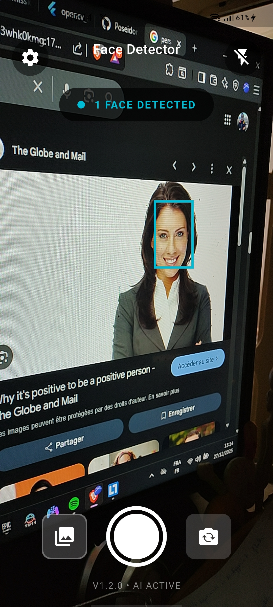
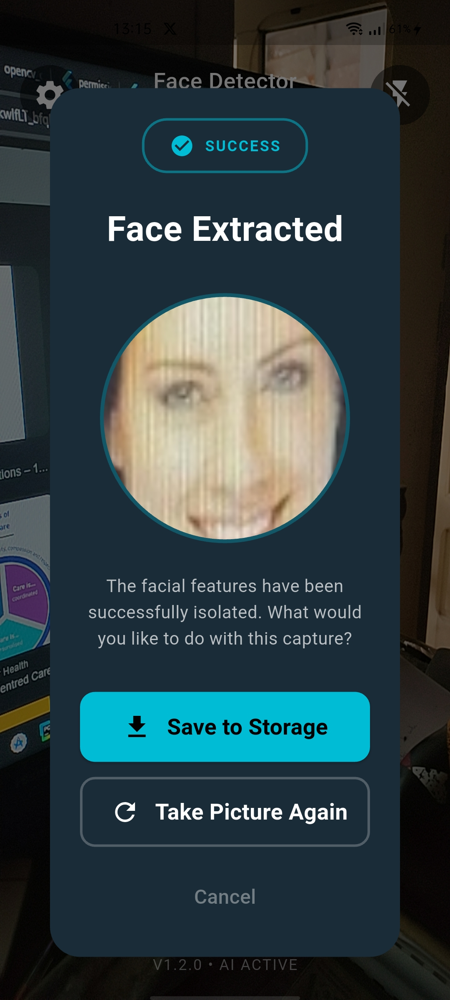

# Where is my face ?

A Flutter application that uses AI-powered face detection to identify and extract faces from camera feed or images. Built with the YuNet model for accurate real-time face detection.

## Features

- ✅ **Real-time Face Detection** - Detect multiple faces simultaneously using camera feed
- ✅ **Face Confidence Score** - Display confidence percentage for each detected face
- ✅ **Face Extraction** - Extract and save detected faces as separate images
- ✅ **Multiple Camera Support** - Switch between front and back cameras
- ✅ **Flash Control** - Toggle flash on/off for better lighting
- ✅ **Modern UI** - Clean, dark-themed interface with intuitive controls
- ✅ **Batch Processing** - Select and save multiple faces at once
- ✅ **Detection Modes** - Switch between Video, Detect, and Portrait modes

## Screenshots

<p align="center">
  
  
</p>

## 🛠️ Tech Stack

- **Flutter SDK**: ^3.9.2
- **Camera**: ^0.11.3 - Camera functionality
- **OpenCV Dart**: ^1.4.3 - Image processing and face detection
- **YuNet Model**: ONNX-based face detection model

## Prerequisites

Before running this project, ensure you have:

- Flutter SDK installed (3.9.2 or higher)
- Android Studio / Xcode (for mobile development)
- Camera permissions configured

## Getting Started

### Installation

1. **Clone the repository**
   ```bash
   git clone <repository-url>
   cd face_extractor
   ```

2. **Install dependencies**
   ```bash
   flutter pub get
   ```

3. **Run the app**
   ```bash
   flutter run
   ```

### Configuration

The YuNet model file (`yunet.onnx`) is located in the `assets/` directory and is automatically loaded when the app starts.

## Project Structure

```
lib/
├── main.dart                              # App entry point
├── components/
│   └── extracted_faces_dialog.dart       # Dialog for displaying extracted faces
├── models/
│   └── face_detection_result.dart        # Face detection data model
├── painter/
│   └── face_detection_painter.dart       # Custom painter for face overlays
├── screens/
│   └── camera_screen.dart                # Main camera and detection screen
└── services/
    └── face_detector_service.dart        # Face detection service using YuNet

assets/
└── yunet.onnx                            # YuNet face detection model
```

## Features Breakdown

### Camera Screen
- **Top Bar**: Settings, app title, and flash toggle
- **Detection Overlay**: Real-time bounding boxes with confidence scores
- **Status Indicator**: Shows number of detected faces
- **Mode Selector**: Switch between VIDEO, DETECT, and PORTRAIT modes
- **Camera Controls**: Gallery access, capture button, and camera flip

### Face Extraction Dialog
- **Single Face Mode**: Shows extracted face with save and retake options
- **Multiple Faces Mode**: Grid of selectable faces with batch save functionality
- **Smart Selection**: Tap to select/deselect individual faces
- **Action Buttons**: Save selected faces, save all faces, or retake picture

## To-Do List

### High Priority
- [ ] **Save to Device Storage** - Implement actual file saving functionality with proper permissions
- [ ] **Image Gallery View** - Create a screen to view all previously extracted faces

### Low Priority
- [ ] **Settings Screen** - Add customizable detection sensitivity and other preferences
- [ ] **Dark/Light Theme** - Add theme switching capability
- [ ] **Share Functionality** - Share extracted faces directly to other apps
- [ ] **Video Recording** - Record video while detecting faces

### Completed 
- [x] Real-time face detection
- [x] Face extraction functionality
- [x] Camera switching (front/back)
- [x] Flash control
- [x] Multiple face detection
- [x] Confidence score display
- [x] Modern UI implementation
- [x] Face selection in dialog
- [x] Pick Image from Gallery


## Configuration

### Android Permissions

Add the following permissions to `android/app/src/main/AndroidManifest.xml`:

```xml
<uses-permission android:name="android.permission.CAMERA" />
<uses-permission android:name="android.permission.WRITE_EXTERNAL_STORAGE" />
<uses-permission android:name="android.permission.READ_EXTERNAL_STORAGE" />
```

## 🎯 How It Works

1. **Camera Initialization**: The app initializes the camera and loads the YuNet model
2. **Frame Processing**: Every 200ms, a frame is captured and processed
3. **Face Detection**: YuNet model detects faces and returns bounding boxes with confidence scores
4. **Visualization**: Detected faces are highlighted with cyan boxes and confidence labels
5. **Extraction**: On capture, faces are cropped from the image using OpenCV
6. **Display**: Extracted faces are shown in a dialog with save options

## Contributing

Contributions are welcome! Please feel free to submit a Pull Request.

## License
This project is open source and available under the MIT License.

## Acknowledgments

- **YuNet Model** - Face detection model by OpenCV
- **OpenCV Dart** - Dart bindings for OpenCV
- **Flutter Team** - For the amazing framework

## Contact

For questions or support, please open an issue in the repository.

---

**Version**: 1.2.0  
**AI**: Active  
**Status**: In Development
